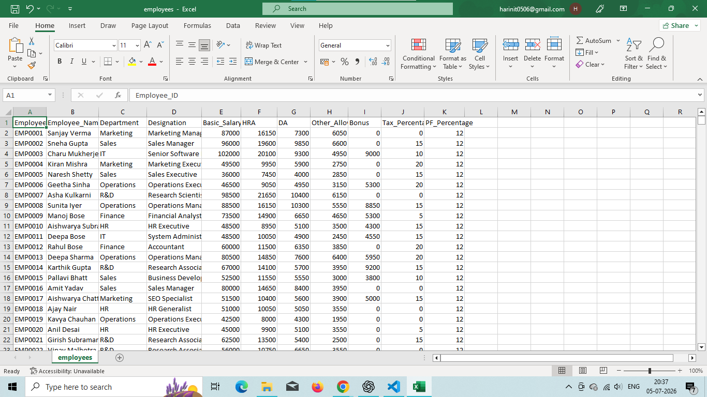
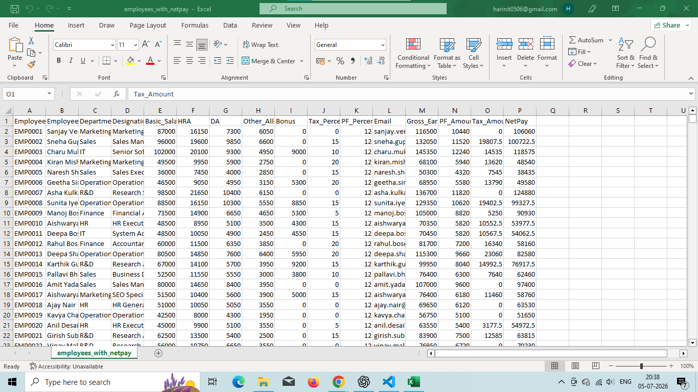
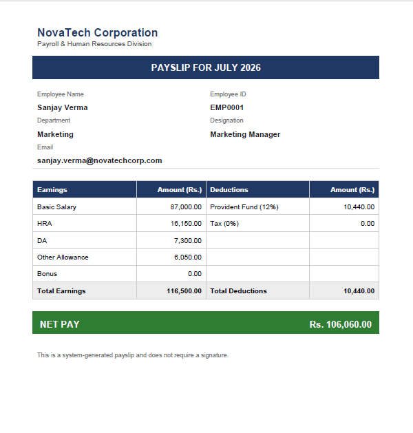
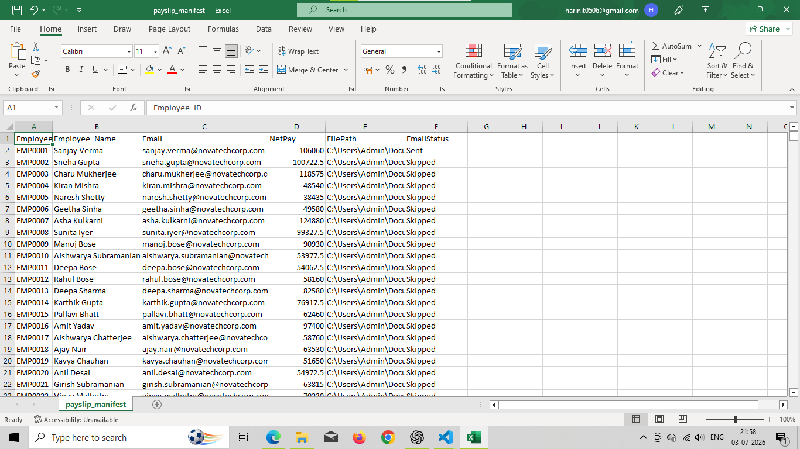

# Automated Payslip Generator System

A Python project that reads employee salary data, calculates Net Pay,
generates a professional PDF payslip for every employee, emails it to
them, and logs the results — all in one automated pipeline.

Built with **pandas**, **reportlab**, and **smtplib**.

---

## Features

- Reads employee data from `.csv` or `.xlsx`
- Calculates Net Pay using a standard salary formula (Basic + HRA + Allowances − PF − Deductions)
- Generates a clean, professional PDF payslip per employee (`output/payslips/`)
- Emails each payslip as a PDF attachment via Gmail SMTP (or any SMTP provider)
- Logs every run to a manifest CSV (`output/logs/payslip_manifest.csv`) showing Net Pay, file path, and email status
- Credentials are never hardcoded — loaded from a local `.env` file
- Proper error handling for missing files, bad emails, and malformed data
- Clean, modular, beginner-friendly code — great for a resume project

---

## Project Structure

```
payslip-generator/
│
├── data/
│   ├── employees.xlsx                # Sample input dataset
│   ├── employees.csv                 # Same data, CSV format (either works)
│   └── employees_with_netpay.csv     # Generated output (created on run)
│
├── output/
│   ├── payslips/                     # Generated PDF payslips (created on run)
│   └── logs/
│       └── payslip_manifest.csv      # Run log (created on run)
│
├── src/
│   ├── main.py                       # Orchestrates the full pipeline
│   ├── pdf_generator.py              # Builds the PDF payslip
│   ├── email_sender.py               # Sends the payslip via email
│   └── utils.py                      # Data loading, Net Pay calculation, helpers
│
├── .env.example                      # Template for email credentials
├── .gitignore
├── requirements.txt
├── README.md
└── run.py                            # Entry point: `python run.py`
```

---

## 1. Setup

### Install dependencies

```bash
python -m venv venv
source venv/bin/activate        # Windows: venv\Scripts\activate
pip install -r requirements.txt
```

### Configure email credentials

Copy the example env file and fill in your real values:

```bash
cp .env.example .env
```

Edit `.env`:

```
SMTP_SERVER=smtp.gmail.com
SMTP_PORT=587
SENDER_EMAIL=your_email@gmail.com
SENDER_PASSWORD=your_app_password_here
```

> **Gmail users:** you cannot use your normal password. Generate a 16-character
> **App Password** at https://myaccount.google.com/apppasswords (requires
> 2-Step Verification to be turned on), and use that instead.

`.env` is listed in `.gitignore`, so your credentials will never be committed.

---

## 2. Prepare your data

Edit `data/employees.xlsx` (or `employees.csv`) with your real employee data.
Required columns:

| Column            | Description                              |
|-------------------|-------------------------------------------|
| EmployeeID        | Unique employee identifier                |
| Name              | Full name                                 |
| Email             | Employee's email address                  |
| Department        | Department name                           |
| Basic             | Basic salary                              |
| HRA_pct           | HRA as a % of Basic (e.g. 20 for 20%)     |
| Allowances        | Flat allowance amount                     |
| Other_Deductions  | Any other deductions (loans, fines, etc.) |

A ready-to-use sample dataset with 10 employees is already included.

## Sample Dataset

The project includes a synthetic employee dataset for testing.

Fields include:
- Employee_ID
- Employee_Name
- Department
- Basic Salary
- HRA (%)
- Allowances
- Other Deductions
- Email

---

## 3. Run the pipeline

From the project root:

```bash
python run.py
```

This will:
1. Load `data/employees.xlsx`
2. Calculate Net Pay for every employee → save `data/employees_with_netpay.csv`
3. Generate a PDF payslip for each employee → save to `output/payslips/`
4. Email each PDF to the employee's address
5. Write a summary log to `output/logs/payslip_manifest.csv`

### To generate PDFs without sending emails

Open `src/main.py` and set:

```python
SEND_EMAILS = False
```

This is useful for testing, since it skips SMTP entirely and just produces
the PDFs and manifest.

### To change the payslip month/year

Also in `src/main.py`:

```python
PAYSLIP_MONTH = "July"
PAYSLIP_YEAR = "2026"
```

---

## Net Pay Formula

```
Net Pay = Basic
        + (Basic × HRA_pct / 100)      # HRA
        + Allowances
        − (Basic × 0.12)               # Provident Fund (12%)
        − Other_Deductions
```

---

## Error Handling

The pipeline is designed to keep running even if one record has a problem:

- **Missing input file** → clear error message, pipeline stops before processing.
- **Missing required columns** → clear error message listing exactly which columns are missing.
- **Non-numeric salary values** → validation error naming the affected EmployeeID(s).
- **Missing/invalid employee email** → that employee's PDF is still generated, but the
  email step is skipped and logged as `Failed: invalid or missing email address`.
- **Missing `.env` credentials** → every email attempt fails gracefully with a clear
  message in the manifest instead of crashing the whole run.
- **SMTP errors** (auth failure, connection issues) → caught and logged per-employee,
  the rest of the batch still completes.

Check `output/logs/payslip_manifest.csv` after every run to see exactly what
succeeded and what needs attention.

---

## Tech Stack

- **pandas** — reading/writing CSV & Excel, data manipulation
- **openpyxl** — Excel file support for pandas
- **reportlab** — PDF generation (tables, styling, layout)
- **smtplib** + **email** (standard library) — sending emails with attachments
- **python-dotenv** — loading credentials from `.env`

---

## Screenshots

### Employee Dataset



### Generated Payslip


### Email Notification


### Payroll Manifest Report



## Notes

- All paths in the code are relative to the project root, so it runs the
  same way on Windows, macOS, and Linux.
- Regenerated files (`employees_with_netpay.csv`, PDFs, manifest) are
  git-ignored by default so your repo only tracks source code and the
  sample dataset.

## Author

Harini T
Aspiring Software Engineer with a focus on AI and Data-Driven Applications.
